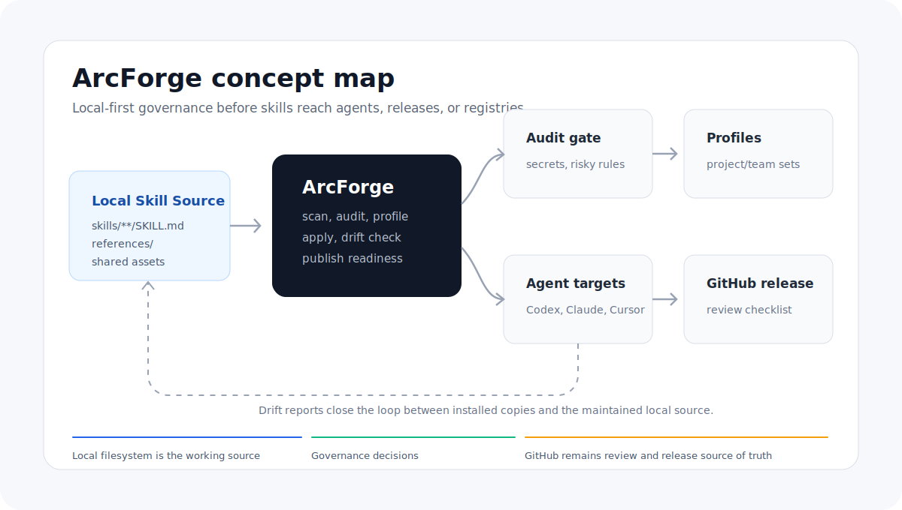

# ArcForge

[简体中文](../../README.md)

ArcForge is a local-first, GitHub-first skill lifecycle governance workspace designed to be used by coding agents.

It helps individuals and small teams move skills from authoring and validation through audit, grouping, apply, drift checks, and release preparation before they are shared with a team or published publicly. The CLI and Desktop app are tools the agent can call; they are not the primary interface users should have to memorize.



## Install ArcForge From This Repository

The recommended way to install ArcForge is to hand this repository to a coding agent, not to start by manually running CLI commands.

1. Clone or open this repository.
2. Open the current project in Codex, Claude Code, Cursor, or another coding agent.
3. Send this prompt to the agent:

```text
执行 skills/arcforge-install
```

The install skill uses the current source checkout to:

- Install `skills/arcforge/` and `skills/arcforge-skill-first/` into the current agent's user-level skill directory.
- Build the local `arcforge` CLI shim.
- Install a `arcforge-desktop` launcher that the agent can open when needed.
- Run headless verification when GUI launch is unavailable.

After ArcForge itself is installed, the install skill guides you through optional Feitianchengzi recommended Skill projects and first explains two modes:

- `arckit`: Feitianchengzi's AI Agent Skills center for the full AI-agent-assisted software development collaboration lifecycle, including ideas and opportunities, decision frameworks, product specs, interaction, visual design, technical solutions, project governance, project memory, pending context, technology-agnostic debug diagnosis, and Workshop Desktop bridging. Technology-stack-specific coding workflows live elsewhere.
- `arckit-code`: Feitianchengzi's technology-stack-specific coding skills repository for language, framework, platform, and SDK-level coding practices. Its current focus is SwiftUI/Apple client architecture, project scaffolding, platform capability boundaries, validation rules, and feedback platform integration.

These repositories are both example Skill projects for ArcForge and recommended practices. Quick install mode applies directly from GitHub to the current agent's user-level skills without creating a persistent maintenance source. Governed mode first confirms the source, maintenance source, application target, profile/skills, and relationship record, then hands execution to the `arcforge` workflow. You can install both, install only one, or skip both; Feitianchengzi internal users and open-source users follow the same GitHub-first installation path.

After installation, open any project in your coding agent and ask the agent to use ArcForge in natural language:

```text
Use arcforge to scan the current project's skills.
Use arcforge-skill-first to turn this workflow into a skill and validate it with a sub-agent.
Use arcforge to audit these skills for team sharing.
Use arcforge to apply the frontend profile to Codex.
Use arcforge to check drift between installed copies and the source repository.
Use arcforge to prepare a GitHub and ClawHub/OpenClaw release checklist.
```

If the agent cannot resolve the install skill, ask it to run this fallback command:

```bash
node skills/arcforge-install/scripts/install-from-repo.mjs --agent codex --desktop install
```

Only add `--update-path` when you explicitly want the script to modify your shell profile. Use `--desktop package` when you need a local Desktop installer.

## Why This Exists

ArcForge started from a specific local workflow need: I wanted a lightweight governance layer before skills are copied into agents, shared with a team, or prepared for public release. With Skill First now part of the core lifecycle, ArcForge also covers how a skill moves from authoring and validation into audit, formalization, and adoption.

That layer should not replace agents, become a marketplace, or bypass GitHub. It should help agents and users inspect source skills locally, fix them, group them, record provenance, and then hand them to existing agents, installers, GitHub, or ClawHub/OpenClaw.

If you run into the same skill management problem, please star the project, open an issue, or send a PR. Real usage signals help decide how much energy this should receive beyond a personal workflow tool.

## Positioning

ArcForge is not a skill marketplace, public registry, search engine, ratings system, paid distribution platform, package manager, or agent runtime.

ArcForge owns the work before distribution:

```text
author/iterate skill -> sub-agent validation -> audit -> profile -> apply -> drift check -> release prep
```

It answers questions like:

- Which skills are approved for this project or team?
- Has a working pattern been captured as a reusable skill and validated on a real task?
- Can the source skills be inspected and fixed before applying them to an agent?
- Is a project-born skill worth moving into a formal Skill project?
- Did an installed copy drift from the GitHub or local source of truth?
- What is still missing before team sharing or public release?
- Which GitHub, ClawHub/OpenClaw, or installer command hints should users receive?

Short version: registries are for discovery and distribution, installers copy skills into agents, and ArcForge decides what should be trusted, grouped, applied, and released.

For detailed product-by-product comparisons, see [comparison.md](comparison.md).

## How It Works

The new usage model is agent-first:

| Part | Role |
|---|---|
| `skills/arcforge-install` | Lets a user clone this repository and complete local installation through a coding agent. |
| `arcforge-skill-first` skill | Captures a working pattern as a skill and validates it with sub-agent preflight/retest loops. |
| `arcforge` skill | The governance workflow entry point for audit, formalization, profiles, apply, drift, and release prep. |
| CLI | The reproducible execution layer the agent calls for scan, audit, apply, drift, share, and JSON results. |
| Desktop | The local workspace the agent opens for visual review, file editing, batch selection, conflict review, or full drift diffs. |
| GitHub | The source of truth for skill review, versioning, releases, and access control. |
| ClawHub/OpenClaw and similar registries | Public publishing targets or release-readiness check targets, not systems ArcForge tries to replace. |

Typical flow:

```text
ask the agent to execute skills/arcforge-install inside the ArcForge repo
-> open the target project in a coding agent
-> use arcforge-skill-first when a skill needs to be authored or improved first
-> ask the agent to use arcforge to scan or audit local skills
-> merge reusable project-born skills into a formal Skill project
-> apply an approved profile into an agent or project target
-> check drift between the formal source and installed copies
-> prepare GitHub-first sharing or public release notes
```

Users do not need to understand every CLI subcommand first. CLI subcommands are the lower-level interface for agents, CI, and debugging.

## When To Use It

Use ArcForge when you need a local governance step before skills are copied into agents, shared with a team, or published publicly.

| Scenario | What ArcForge does |
|---|---|
| Private team skill repo | Keeps skill changes reviewed in Git without running a registry. |
| Per-project agent setup | Installs only the approved skills a project should use. |
| Project-born skill maintenance | Moves reusable skills from a business project into a formal Skill project. |
| GitHub-sourced skill project maintenance | Shows whether the current Git checkout is behind upstream before you choose to update. |
| Pre-publication review | Checks secrets, risky instructions, weak metadata, and internal references. |
| Multi-agent drift control | Compares installed copies with the source Skill project. |
| Local skill editing | Opens `SKILL.md`, references, and scripts in Desktop for review and edits. |
| CI guardrail | Produces machine-readable checks before sharing or publishing. |

If you only want to browse public skills or install one public skill into one agent, ArcForge is not the shortest path. Prefer a registry or installer for that.

## Skill Project Shape

Keep reusable skills in a formal Skill project and let GitHub be the source of truth:

```text
my-skills/
  skills/
    code-review/
      SKILL.md
      references/
    release-writer/
      SKILL.md
      scripts/
```

A single skill folder is also valid as a local or GitHub source:

```text
code-review/
  SKILL.md
  references/
```

When skills live in project-local agent directories such as `.codex/skills`, `.claude/skills`, or `.cursor/skills`, keep the project root as the governance root. ArcForge passes the agent skill directory as `--source-dir` to the CLI so local project state, Git state, applied-source records, and drift reports stay attached to the real project instead of the hidden agent directory.

ArcForge stores local project settings under `~/.arcforge/projects` so GitHub source checkouts do not become dirty just because profiles or targets changed. Legacy `arcforge.config.json` files in project roots are migrated into user-level project state when needed.

Example config shape:

```json
{
  "version": 1,
  "sourceDir": "skills",
  "teamRepo": "github.com/acme/team-skills",
  "profiles": [
    {
      "name": "frontend",
      "description": "Skills approved for frontend projects.",
      "skills": ["code-review", "release-writer"],
      "targets": ["codex", "claude", "cursor"]
    }
  ]
}
```

## Desktop

Usage demo:


Desktop is the local governance workspace, not the first thing users must open. The agent usually opens it when:

- Audit findings need direct edits to `SKILL.md`, references, or scripts.
- Profiles need visual review, batch selection, or apply decisions.
- Apply, merge, or share conflicts need review.
- Installed copies and sources need a full drift diff.

Run from source for development:

```bash
npm install
npm run dev
```

Build a local desktop package:

```bash
npm run package
```

Release builds include the same CLI engine. After the app starts, it installs a user-level `arcforge` shim and reports whether the shim is available on PATH.

## CLI

The CLI is ArcForge' reproducible execution layer for agents, CI, and debugging.

Usage video: [ArcForge CLI demo](../assets/arcforge-cli-demo.mp4)

Build and run the CLI locally:

```bash
npm install
npm run build:cli
node dist/cli/index.js help
```

Common low-level commands:

```bash
arcforge scan --root .
arcforge audit --root .
arcforge source status --root .
arcforge source update --root . --confirm
arcforge merge plan --root . --to ../team-skills --skills code-review --target-path skills/project-a
arcforge merge run --root . --to github.com/acme/team-skills --skills code-review --target-path skills/project-a --confirm
arcforge applied list --root .
arcforge applied drift --root .
arcforge apply --from ../team-skills --profile default --target ~/.codex/skills
arcforge drift --from github.com/acme/team-skills --profile default --target ~/.codex/skills
arcforge publish-plan --root . --visibility public
arcforge share plan --root . --repo github.com/acme/team-skills --profile frontend
arcforge share run --root . --repo github.com/acme/team-skills --profile frontend --message "Share frontend skills" --confirm
arcforge doctor
```

Remote Skill projects passed to `merge`, `apply`, or `drift` are downloaded to a local cache first and then treated as local folders. `source status` and `source update` are independent Git checkout operations: they inspect the current `--root`, report ahead/behind status, and only update with `--confirm` using a fast-forward-only pull.

## Project Status

Early MVP. APIs, config shape, and Desktop UX may change before `1.0`.

Further docs:

- [Product brief](product.md)
- [Comparison](comparison.md)
- [Architecture](architecture.md)
- [Roadmap](roadmap.md)
- [Release notes](release-notes.md)
