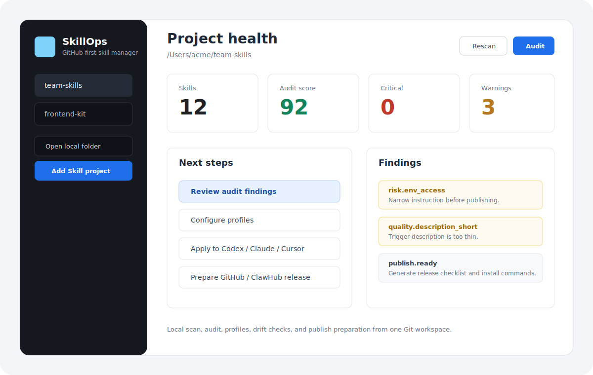
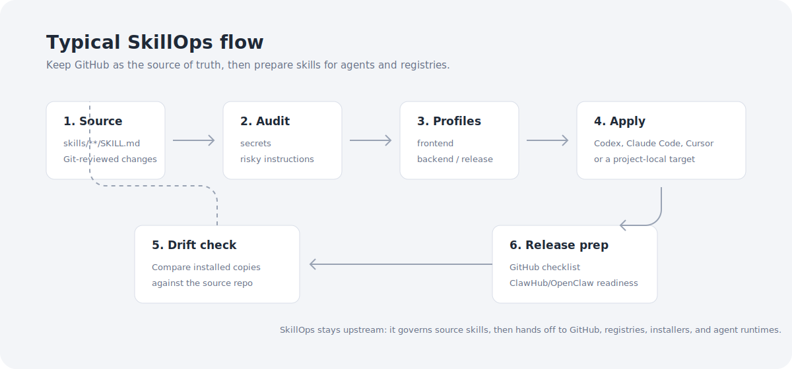

# SkillOps

[English](../../README.md)

## 为什么会有这个项目

SkillOps 最开始是我自己的一个需求：我希望有一个小而本地优先的工具，用来在 skills 被复制到 agent 或分享给别人之前，先把它们管理起来。我现在也不确定这个方向是否真的值得长期投入，所以不想在没有明确反馈前把它做得过重。

如果你也有 skill 管理需求，并且在现有工具里找不到符合自己工作方式的方案，欢迎给这个项目一个 star、提 issue，或者直接发 PR。这能让我知道不是只有我一个人遇到这类问题。

大家的 star 是我判断是否继续投入 SkillOps 的最直接信号。真实需求越多，我就越有理由把它从个人工作流工具，继续维护成一个更认真可用的项目。

面向 AI agent skills 的本地优先、GitHub 优先治理工作台。

SkillOps 帮助个人开发者和小团队把 `SKILL.md` 文件变成经过审计、分组、可共享的资产，然后再安装到 agent，或发布到 GitHub/ClawHub。



## 定位

SkillOps 不是 skill marketplace、公开 registry、包管理器，也不是 agent runtime。

它负责分发之前的工作流：

```text
编写 skill -> 审计 -> 组成 profile -> 应用到目标 -> 检查 drift -> 发布准备
```

SkillOps 主要回答这些运营问题：

- 哪些 skills 是这个项目或团队批准使用的？
- 这个 skill 是否适合共享或公开发布？
- 已安装副本是否偏离了源仓库？
- 应该给用户什么安装命令和发布 checklist？

## 和同类产品的差异

| 产品类型 | 代表产品 | 它们主要解决 | SkillOps 解决 |
|---|---|---|---|
| 公开 skill registry | [ClawHub/OpenClaw](https://github.com/openclaw/clawhub)、skills.sh | 发现、公开发布、搜索、marketplace 体验 | 发布前准备；继续让 GitHub 做 source of truth |
| 跨 agent 安装工具 | [skillshare](https://github.com/runkids/skillshare)、[npx skills](https://github.com/vercel-labs/skills) | 把 skills 安装和同步到多个 agent | 围绕这些工具生成 profiles、审计门禁、drift report 和发布计划 |
| Agent 原生系统 | [Claude Code plugins](https://code.claude.com/docs/en/plugins)、[Claude skills](https://code.claude.com/docs/en/skills)、Cursor rules | runtime 加载、激活、agent 专属行为 | 在复制到 runtime 目录前管理源 skills |
| 项目指令文件 | `AGENTS.md`、`CLAUDE.md`、`.cursor/rules` | 告诉某个项目或 agent 如何工作 | 跨项目、跨 agent 管理可复用的 `SKILL.md` 资产 |
| MCP registry | [Smithery](https://smithery.ai/) 等 MCP 目录 | 发现和安装 MCP servers | 专注 skill 治理，不做 tool-server 分发 |

一句话：registry 用来发现和分发，installer 用来复制到 agent，SkillOps 用来判断哪些 skill 值得信任、如何分组、如何应用、如何发布。

更详细的逐项对比见 [对比说明](comparison.md)。

## 什么时候用

适合使用 SkillOps 的情况：

- 你把 skills 放在 Git 里，希望所有变更可 review
- 团队希望每个项目有一组批准过的 skills
- 你同时使用 Codex、Claude Code、Cursor、OpenClaw 等多个 agent
- 你想公开发布 skills，但不想泄露内部路径、token 或流程说明
- 你需要 CLI 在 CI 中检查 skill 仓库

如果你只是想浏览公开 skills，或一次性给某个 agent 安装一个 skill，SkillOps 不是最短路径。

## 怎么用

```bash
npm install
npm run dev
```

本地构建并启动：

```bash
npm run build
npm start
```

构建后使用 CLI：

```bash
npm run build
node dist/cli/index.js scan --root .
node dist/cli/index.js audit --root .
node dist/cli/index.js drift --root . --profile default --target .skillops/skills
node dist/cli/index.js publish-plan --root . --visibility public
```

推荐工作区结构：

```text
my-skills/
  skillops.config.json
  skills/
    code-review/
      SKILL.md
      references/
    release-writer/
      SKILL.md
```

最小配置示例：

```json
{
  "version": 1,
  "sourceDir": "skills",
  "teamRepo": "github.com/acme/team-skills",
  "profiles": [
    {
      "name": "frontend",
      "description": "Skills approved for frontend projects.",
      "skills": ["code-review", "release-writer"],
      "targets": ["codex", "claude", "cursor"]
    }
  ]
}
```

## 典型场景



| 场景 | 为什么需要 SkillOps | 主要能力 |
|---|---|---|
| 团队私有 skill 仓库 | 不搭 registry，也能让 skill 变更经过 Git review | scan、audit、profiles、GitHub share plan |
| 按项目配置 agent | 每个项目只安装它应该使用的 skills | profiles、apply-profile、target history |
| 公开发布前检查 | 检查 secrets、风险指令、薄弱 metadata 和内部引用 | audit、public publish plan、release checklist |
| 多 agent 漂移控制 | 比较已安装副本和源仓库是否一致 | drift report、apply-profile |
| CI 守门 | 在未审计 skill 合并前给出 JSON 检查结果 | JSON CLI output |

## 项目状态

早期 MVP。`1.0` 之前 API 和配置结构可能会变化。

更多文档：

- [产品说明](product.md)
- [对比说明](comparison.md)
- [架构说明](architecture.md)
- [路线图](roadmap.md)
